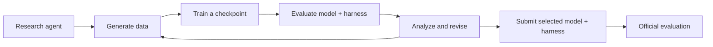

<h1 align="center">RSIGym: A Flexible Environment for Recursive Self-Improvement</h1>

<div align="center">

[![Evolvent AI][evolvent-image]][evolvent-url]
[![Paper][paper-image]][paper-url]
[![Website][website-image]][website-url]
[![Records][records-image]][records-url]
[![GitHub][github-image]][github-url]
[![X][x-image]][x-url]
[![小红书][xhs-image]][xhs-url]

</div>

An **agent-native · service-based · budget-controlled** environment for AI research. RSIGym gives a research agent reusable tools to generate data, train models, evaluate candidates, and revise execution harnesses. The agent chooses the experiments; the platform handles the infrastructure, permissions, and service budget.

**RSI-Index** measures how much of the remaining performance gap those experiments close across five benchmark domains.

## ✨ Features

- **Everything as a Service** — Training, inference, rollout, evaluation, and sandbox execution are available through reusable interfaces. Agents work in lightweight, CPU-only containers and call the services when needed.
- **Three improvement tracks** — Study training data, execution harnesses, or their joint optimization through configurable permissions.
- **A shared research budget** — Each run receives one platform key with a service budget and access rules. Authorization checks and cost accounting are shared across services.
- **Evidence for the next experiment** — Training metrics, per-task rewards, execution logs, and trajectories help agents diagnose failures and choose what to try next.
- **Inspectable research runs** — Task definitions specify the initial system, allowed changes, submission artifacts, evaluation protocol, and post-run audits.

## 🏗 How it works



The **research agent** designs and runs experiments. The **target system** is the model and execution harness it improves. These can be different models, or the same model in a self-improvement experiment.

### Services

| Component | What it provides | Implementation |
|---|---|---|
| Training | LoRA fine-tuning, training metrics, checkpoints | [train_server](train_server/README.md), backed by Tinker |
| Inference | OpenAI-compatible access to base models and trained checkpoints | [model_server](model_server/README.md), backed by Tinker |
| Rollout | Frontier-model calls for data generation and judging | [rollout_server](rollout_server/README.md), through an OpenAI-compatible upstream |
| Evaluation | Benchmark jobs, task rewards, trajectories, and logs | [benchmark_server](benchmark_server/README.md), using Harbor and E2B |
| Sandbox | Isolated computation through the E2B SDK | [e2b_proxy](e2b_proxy/README.md) |
| Authorization | Run keys, permissions, and service-budget accounting | [auth_server](auth_server/README.md) |

### Improvement tracks

| Track | The agent can change | Held fixed |
|---|---|---|
| **Data** | Training data | Training settings and harness |
| **Harness** | Execution harness | Model weights |
| **Joint** | Training data, training settings, and harness | Starting base model and evaluation protocol |

The same service infrastructure supports all three tracks. Each task's `key.json` defines its budget and service permissions; `instruction.md` describes the research objective and submission rules.

## 📊 Results

The main study compares **six research agents across five domains**, with a **$500 platform-service budget per benchmark run**. Each Joint run starts from **Qwen3.5-35B-A3B-Base** and a minimal harness.

| Research agent | RSI-Index ↑ | SWE-bench Verified | Terminal-Bench 2.0 | AIME 2024/2025 | GPQA Diamond | SkillsBench |
|---|---:|---:|---:|---:|---:|---:|
| Opus 5 | **0.4809** | 50.33 | **26.97** | **97.78** | 83.33 | 21.21 |
| Opus 5.5 | 0.4528 | 52.67 | 21.72 | 95.56 | **85.33** | 9.48 |
| DeepSeek V4.1 Flash | 0.4343 | **53.33** | 20.97 | 87.78 | 83.33 | 15.68 |
| Astra | 0.4093 | 35.67 | 22.10 | 88.33 | 84.33 | 20.44 |
| Sol 6.1 | 0.3321 | 18.67 | 22.10 | 88.89 | 81.00 | 8.70 |
| Sol 6 | 0.2079 | 19.67 | 17.60 | 82.78 | 50.33 | **22.14** |
| Initial system | 0.0000 | 17.67 | 10.49 | 31.67 | 51.33 | 1.65 |

Benchmark scores are percentages. RSI-Index uses the paper's original scale:

```text
RSI-Index = mean over benchmarks of (final score − initial score) / (1 − initial score)
```

The formula uses scores in `[0, 1]` and weights the five benchmarks equally. An index of `0.4809` means that the selected systems close **48.09% of the remaining performance gap on average**.

- **29 of 30** Joint runs improve over their initial system. Four different researchers lead at least one benchmark.
- Evaluation uses 100 SWE-bench Verified tasks, 89 Terminal-Bench tasks, 60 AIME problems, 100 GPQA Diamond questions, and 37 SkillsBench tasks from the **science, office, and finance** subsets.
- Scores use **avg@3**: the mean reward over three attempts per task. Each research configuration is run once, and final evaluations reuse tasks available during development.
- Research-agent inference and final official evaluation are billed separately from the platform-service budget.

### Two additional experiments

- **Iterating an existing harness.** With Qwen3.6-35B-A3B-Instruct weights fixed, Opus 5 revises DSH and raises Terminal-Bench from **30.34% to 40.82%**. Tasks solved on all three attempts increase from **15 to 26**.
- **Qwen3.8-27B as researcher and target.** The model completes training, candidate comparison, and submission, but the selected system scores **56.26% versus 56.66%** initially on all 37 SkillsBench tasks. Its six-task development gain does not translate into an overall improvement.

## 📂 Run Records

We've made all our run records (agent trajectories) publicly available. We invite everyone to explore the trajectories and examine how agents behave during recursive self-improvement (RSI).

**[Download the run records (Google Drive)][records-url]**

## 🚀 Quick Start

### 1. Clone the repository

```bash
git clone https://github.com/evolvent-ai/RSIGym.git
cd RSIGym
```

Use **Python 3.12+** and **uv**. Running research tasks also requires **Harbor 0.20.x**, `curl`, `jq`, and a configured execution backend such as Docker. Service operators need access to Tinker, E2B, and the chosen rollout-model provider.

This is a monorepo: each service and the task runner has its own Python environment.

### 2. Configure the platform services

Start authorization first:

```bash
cd auth_server
cp .env.example .env
# Fill in the admin key and the shared service-authentication key.
uv sync
uv run python -m auth_server.main
```

In separate terminals, configure and start the services you need. For example:

```bash
cd train_server
cp .env.example .env
# Configure Tinker credentials, the training admin key, and authorization settings.
uv sync
uv run python -m train_server.main
```

Run each command from the corresponding directory under the repository root. Follow the [service READMEs](#services) for provider credentials, endpoints, permissions, and startup commands. Register the evaluation datasets through the benchmark service before launching a task.

### 3. Launch a research task

From the repository root:

```bash
uv tool install 'harbor[e2b]>=0.20.0,<0.21.0'
cd rsi_task
uv sync
cp .env.example .env
```

Fill in service endpoints, the authorization admin key, verifier keys, and research-model credentials in `.env`. Choose a model identifier available through your research-model endpoint:

```bash
export RSIGYM_RESEARCH_MODEL='your-research-model-id'
sh run.sh joint/minimal-swe-verified-opus-5 \
  --agent claude-code --model "$RSIGYM_RESEARCH_MODEL"
```

`run.sh` reads the task's `key.json`, issues a budgeted platform key, injects it into the research environment, and launches Harbor. Additional arguments are forwarded to `harbor run`.

Example task definitions:

| Experiment | Task directory |
|---|---|
| Data on SWE-bench Verified | [rsi_task/data/minimal-swe-verified-opus-5](rsi_task/data/minimal-swe-verified-opus-5) |
| Harness on Terminal-Bench | [rsi_task/harness/minimal-terminal-bench-2-0](rsi_task/harness/minimal-terminal-bench-2-0) |
| Joint on SWE-bench Verified | [rsi_task/joint/minimal-swe-verified-opus-5](rsi_task/joint/minimal-swe-verified-opus-5) |
| DSH-harness iteration | [rsi_task/harness/dsh-terminal-bench-2-0](rsi_task/harness/dsh-terminal-bench-2-0) |
| Qwen3.8 self-improvement | [rsi_task/joint/pi-skillsbench-qwen3-8-27b](rsi_task/joint/pi-skillsbench-qwen3-8-27b) |

Select the matching Harbor adapter and model for other researchers. Read each task's `instruction.md` and `task.toml` before running it; submission requirements and environment configuration vary by track.

### 4. Inspect and audit a run

The live dashboard defaults to `rsi_task/jobs`:

```bash
# From the repository root
cd tools
uv run rsiwatch
```

Open `http://127.0.0.1:8420`. See [tools/README.md](tools/README.md) for live trajectories, per-trial status, and resource summaries.

For a task with an `audit/` directory, run its post-run audit from `rsi_task`:

```bash
sh audit.sh jobs/<job-name>/<trial-name>
```

## 📁 Project structure

```text
RSIGym/
├── auth_server/       # Run keys, permissions, and budget accounting
├── train_server/      # Tinker-backed training service
├── model_server/      # OpenAI-compatible checkpoint inference
├── rollout_server/    # Frontier-model gateway
├── benchmark_server/  # Harbor evaluation on E2B
├── e2b_proxy/         # Sandbox access and isolation
├── skills/            # Service documentation supplied to research agents
├── rsi_task/          # Current Data, Harness, and Joint tasks; launch and audit scripts
├── rsi_task_legacy/   # Earlier task definitions
└── tools/             # Live research dashboard
```

[evolvent-image]: https://img.shields.io/badge/Evolvent_AI-evolvent.co-0f141b
[evolvent-url]: https://evolvent.co
[paper-image]: https://img.shields.io/badge/Paper-RSIGym-b31b1b
[paper-url]: https://arxiv.org/abs/2610.10310
[website-image]: https://img.shields.io/badge/Website-RSIGym-3454D1
[website-url]: https://rsi-index.ai/
[records-image]: https://img.shields.io/badge/Records-Agent_Trajectories-4285F4
[records-url]: https://drive.google.com/file/d/1NslLPgjv7FXY3cS47oie-UBFotV6Ifga/view?usp=sharing
[github-image]: https://img.shields.io/badge/GitHub-RSIGym-181717?logo=github&logoColor=white
[github-url]: https://github.com/evolvent-ai/RSIGym
[x-image]: https://img.shields.io/badge/X-Announcement-000000?logo=x&logoColor=white
[x-url]: https://x.com/FanqingMengAI/status/2108030344322789563
[xhs-image]: https://img.shields.io/badge/小红书-Announcement-FF2442
[xhs-url]: http://xhslink.com/o/7leCmGY8IBN
